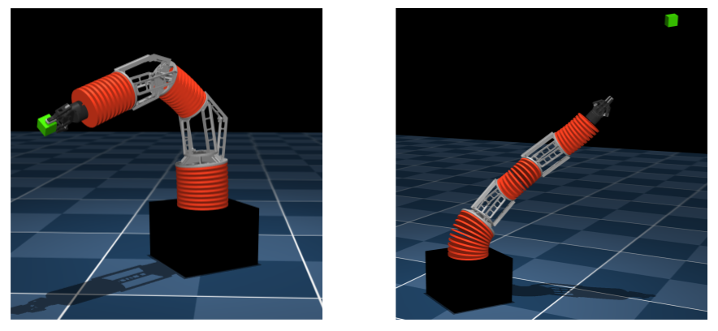

# Bellows Arm Control

Simulated environment code for the paper  
### Learning Dynamic Tasks on a Large-scale Soft Robot in a Handful of Trials - [Project Page](https://sites.google.com/view/bayesoptsoftrobotcontrol)
**Abstract**
Soft robots offer more flexibility, compliance, and adaptability than traditional rigid robots. They are also typically lighter and cheaper to manufacture. However, their use in real-world applications is limited due to modeling challenges and difficulties in integrating effective proprioceptive sensors. Large-scale soft robots ($\approx$ two meters in length) have greater modeling complexity due to increased inertia and related effects of gravity. Common efforts to ease these modeling difficulties such as assuming simple kinematic and dynamics models also limit the general capabilities of soft robots and are not applicable in tasks requiring fast, dynamic motion like throwing and hammering. To overcome these challenges, we propose a data-efficient Bayesian optimization-based approach for learning control policies for dynamic tasks on a large-scale soft robot. Our approach optimizes the task objective function directly from commanded pressures, without requiring approximate kinematics or dynamics as an intermediate step. We demonstrate the effectiveness of our approach through both simulated and real-world experiments.

## Environments
**Throwing Task:**

<div align="center" style="display: flex; justify-content: center; align-items: flex-start;">


</div>

**Hammering Task:**

<div align="center" style="display: flex; justify-content: center; align-items: flex-start;">


</div>

## Installation
*Instructions tested on ubuntu 20.04 and Python3.8*

1. Clone the repo and run pip install from within a virtualenv. 
```bash
pip install -e .
```
2. Test simulation. There are two completely independent ways to simulate the arm:

   - **Via `simulate_env.py` (composer):** This is the relevant part for this project. It builds the arm dynamically depending on the environment using `dm_control`'s composer. The composer environments handle stepping the dynamics for you, providing a higher-level interface for agent interaction. 

     ```bash
     python simulate_env.py
     ```
    It may require pressing the spacebar to start.

   - **Via `simulate.py` (plain MuJoCo):** This is a plain MuJoCo sandbox which uses `mujoco_viewer` with MJCF files. With this method, you have to explicitly manage your robot model (`MjModel`) and data (`MjData`), and manually step the simulation forward. This provides a more low-level, granular control over the simulation.
   
     ```bash
     python src/bellows_arm_control/mujoco/simulate.py
     ```

## ToDo's

- [X] Add Mujoco environments
- [ ] Add BayesOpt Code
- [ ] Add Genetic algorithm baselines

## Bibtex
If you find this useful, please cite the paper!
```bash
@inproceedings{Zwane2024,
 author = {Sicelukwanda Zwane and Daniel G. Cheney and Curtis C Johnson and Yicheng Luo and Yasemin Bekiroglu and Marc Killpack and Marc P. Deisenroth},
 booktitle = {Proceedings of the International Conference on Intelligent Robots and Systems (IROS)},
 date = {2024-10-14},
 title = {Learning Dynamic Tasks on a Large-scale Soft Robot in a Handful of Trials},
 year = {2024}
}
```
